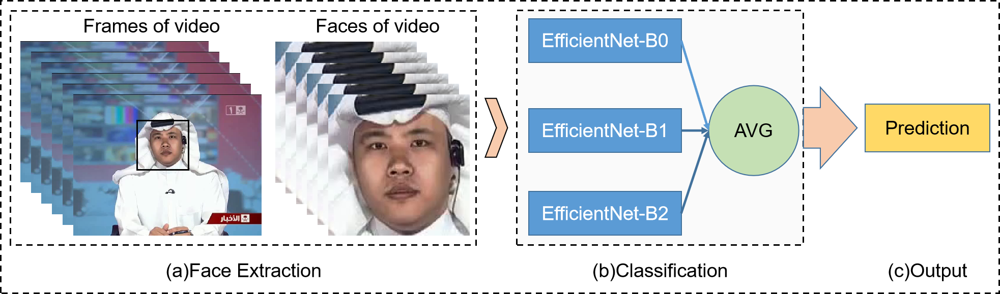

# DeeperForensics Challenge Solution
This repo provides an solution for the [DeeperForensics Challenge 2020](https://competitions.codalab.org/competitions/25228). Our solution achieve the 1st in the development phase of the DeeperForensics Challenge.
The ranking can be seen [here](https://competitions.codalab.org/competitions/25228#results)

## Authors
Team name: Forensics  
Username: BokingChen
- [Baoying Chen](https://github.com/beibuwandeluori)
- [Peiyu Zhuang](https://github.com/ZhuangPeiyu)
- [Sili Li](https://github.com/szu-lisili)


## Pipeline

#### 1. Face Extraction
We firstly extract 15 frames from each video at equal intervals by using VideoCapture of Opencv, and then detect the face region of each frame by using face detector MTCNN and expand the region by 1.2 times to crop the face image.
#### 2. Classification
We predict the probability that face is fake as face score. The result of three models(EfficientNet-B0, EfficientNet-B1 and EfficientNet-B2) are ensembled here for each face. 
#### 2. Output
The final output score of video is the predicted probability that video is fake, which is calculated as average of the scores of faces that is extracted from frames of video.

## Training
### Tricks
1. Data Augmentation: official augmentation provided in [here](https://github.com/EndlessSora/DeeperForensics-1.0/tree/master/perturbation).
There are color saturation(CS), color contrast(CC), ocal block-wise(BW), white Gaussian noise in color components(GNC), Gaussian blur(GB) and JPEG compression(JPEG), which are applied directly on the face images. Moreover, 
we also random mixup these distortions with a probability of 0.2.
2. LabelSmoothing Loss
3. Add more data: UADFV, DFD, FF++, Celeb-DF and DFDC

### pretrained weights

The pretrained weights for efn-b0, efn-b1 and efn-b2 (pretrained in my dataset)
You can clip [here](https://drive.google.com/file/d/1O2ztuYfVSnRDn-WW5bSPwtdzjoR0Jn11/view?usp=sharing) to download.

```bash
cd train 
python train_add_data_my_aug.py
```

## Test 

```bash
python local_test.py
```

It will run the algorithms in the evaluation workflow on some example videos and print out the results.

The output will look like:

```
    ================================================================================
    all videos finished, showing verification info below:
    ================================================================================
    
INFO:root:Video ID: 000000.mp4, Runtime: 7.3909759521484375e-06
INFO:root:	gt: 0
INFO:root:	output probability: 0.5
INFO:root:	number of frame: 1
INFO:root:	output time: 7.3909759521484375e-06
INFO:root: 
INFO:root:Video ID: 000001.mp4, Runtime: 2.3603439331054688e-05
INFO:root:	gt: 1
INFO:root:	output probability: 0.5
INFO:root:	number of frame: 1
INFO:root:	output time: 2.3603439331054688e-05
INFO:root: 
INFO:root:Video ID: 000002.mp4, Runtime: 8.106231689453125e-06
INFO:root:	gt: 1
INFO:root:	output probability: 0.5
INFO:root:	number of frame: 1
INFO:root:	output time: 8.106231689453125e-06
INFO:root: 
INFO:root:Video ID: 000003.mp4, Runtime: 2.2649765014648438e-05
INFO:root:	gt: 0
INFO:root:	output probability: 0.5
INFO:root:	number of frame: 1
INFO:root:	output time: 2.2649765014648438e-05
INFO:root: 
INFO:root:Done. Average FPS: 64776.896
```
